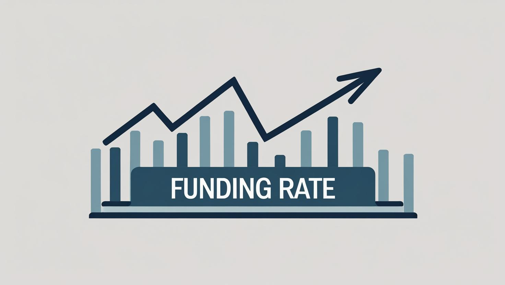

Funding_rate_bot

Як змінити параметри
Час входження фандингової угоди:
Змініть умову в check_funding_time. Наприклад, для відкриття за 5 секунд до фандингу:
python

Копіювати
if 4 <= time_to_funding <= 5 and not self.open_funding_order_id:
Час фандингової угоди:
Змініть self.trade_duration_ms у __init__. Наприклад, для 10 секунд:
python

Копіювати
self.trade_duration_ms = 10000  # 10 секунд
Тейк-профіт:
Змініть self.take_profit_percent у __init__. Наприклад, для 2%:
python

Копіювати
self.take_profit_percent = 2.0
Округлення тейк-профіту (round(take_profit, 2)) можна змінити залежно від монети (наприклад, 3 для вищої точності).
Монета та інтервал фандингу:
Змініть self.selected_symbol = "LPTUSDT" на потрібну монету (наприклад, "BTCUSDT").
Змініть self.funding_interval_hours = 1 на 8 для реального розкладу Bybit.