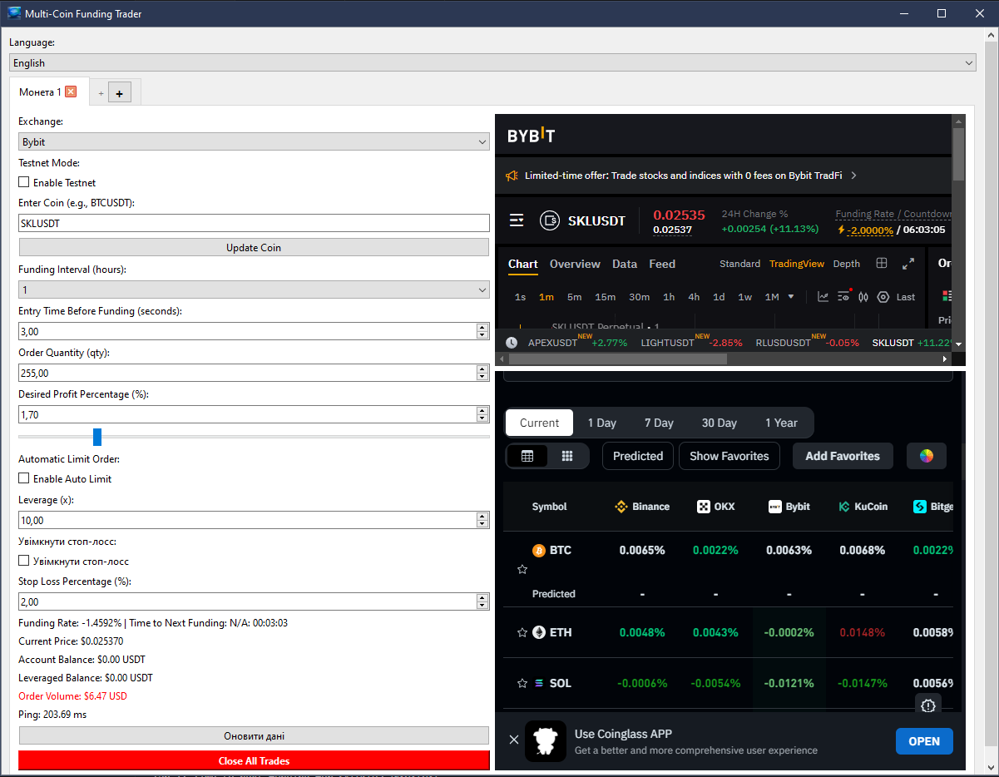

FUNDING RATE


## Fund_rate_py

[](https://www.python.org/downloads/)[](LICENSE)[](https://github.com/Smilelife1177/fund_rate_PY/issues)

A Python-based tool to earn motions when updating the funding rate on different exchanges

Key features:

- Real-time funding rate tracking for Bybit and Binance.
- Support for both mainnet and testnet API keys.
- Simple setup with a batch script for launching the application.
- Calculation of setting a limit application

## Installation

1. **Install Git**
   If you don't have Git installed, download it from [Gits official site](https://git-scm.com/downloads).
2. **Install Python**
   Ensure you have Python 3.7 or higher installed. Download it from [Pythons official site](https://www.python.org/downloads/).
3. **Clone the Repository**
   Open a terminal or command prompt and run:

   ```bash
   cd Desktop
   git clone https://github.com/Smilelife1177/fund_rate_PY.git
   cd fund_rate_PY
   ```

Install the required libraries by running

```
pip install -r requirements.txt
```

To start working with application type

```
span
```

It create an .env fil with text, u need to put your apis keys to that file after "="

```
BYBIT_API_KEY =oleg
BYBIT_API_SECRET =andrii
BYBIT_API_KEY_TEST =serhii
BYBIT_API_SECRET_TEST =sasha
BINANCE_API_KEY =vladik
BINANCE_API_SECRET =vasya
BINANCE_API_KEY_TEST =tolik
BINANCE_API_SECRET_TEST =nikita
```

Run code by pressing "F5"

U will see that window:



Credits

Lead Developer - Oleg Shapran (@Smilelife1177) (shapran1177@gmail.com)

## License

The MIT License (MIT)

Copyright (c) 2025 Oleg Shapran
